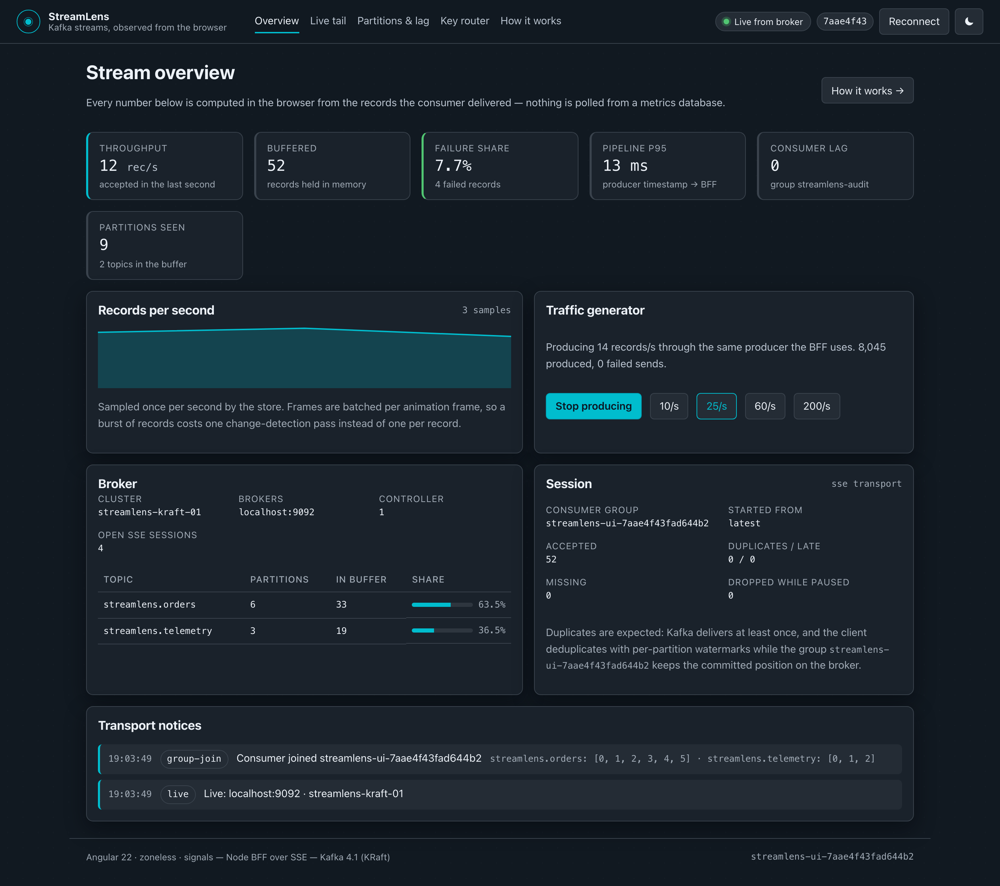
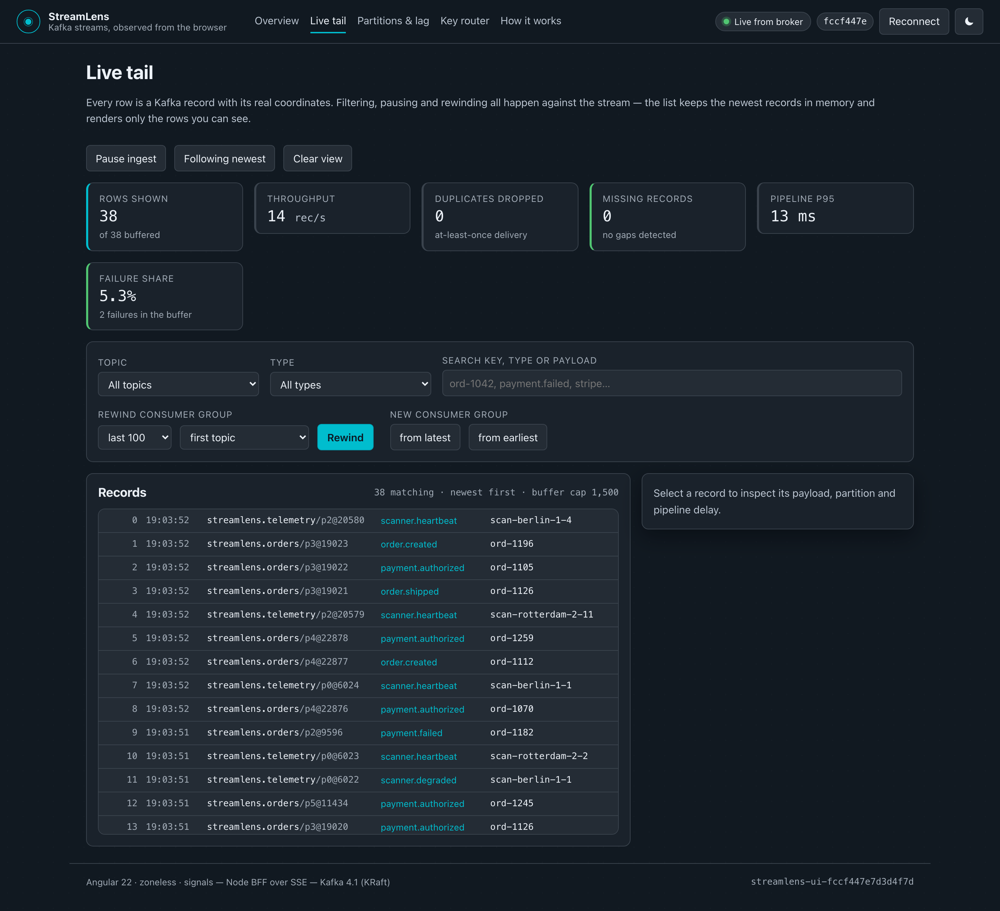
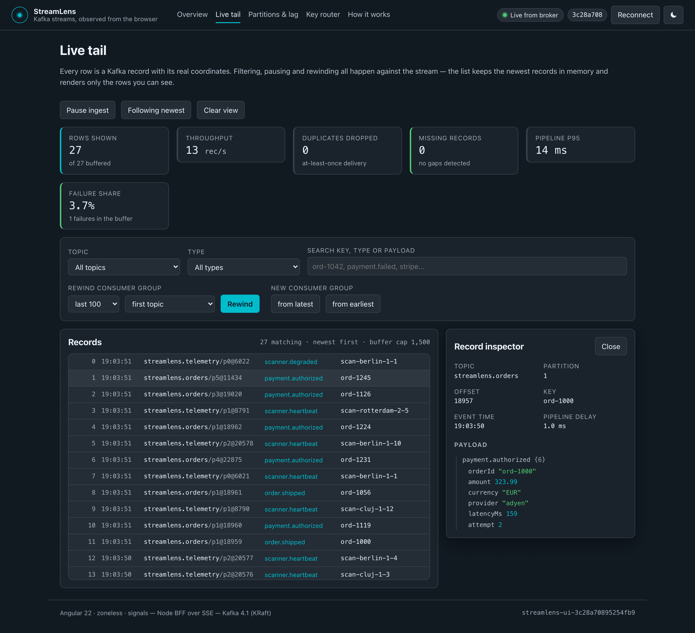
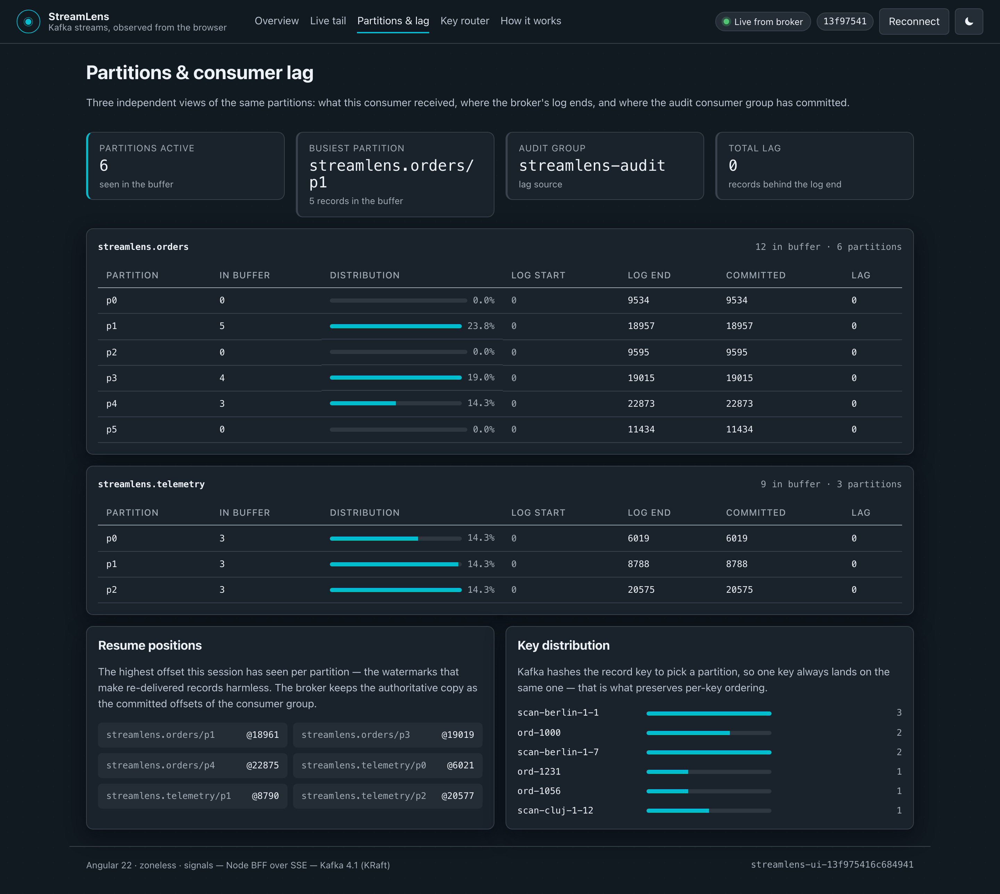
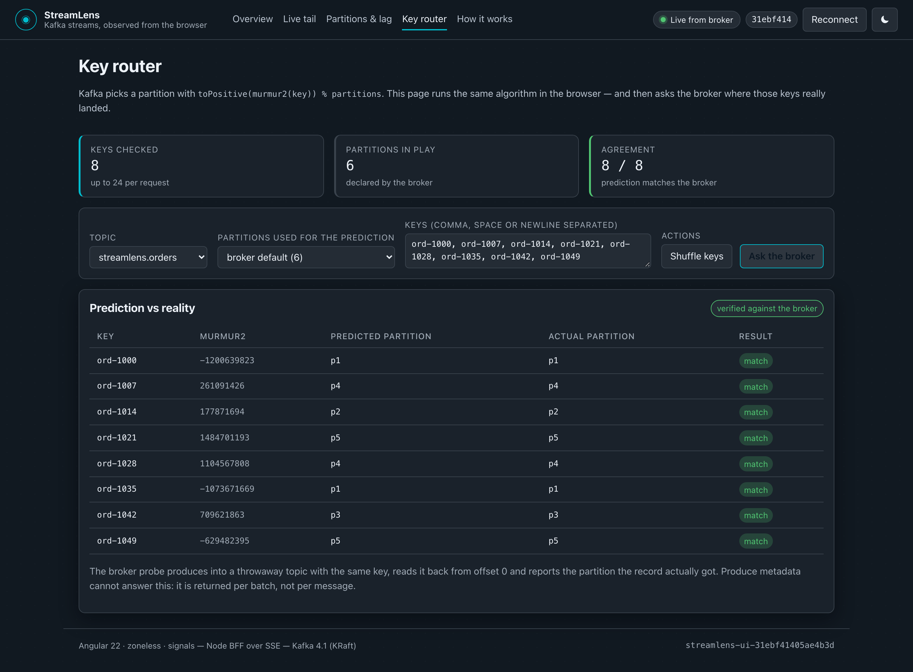
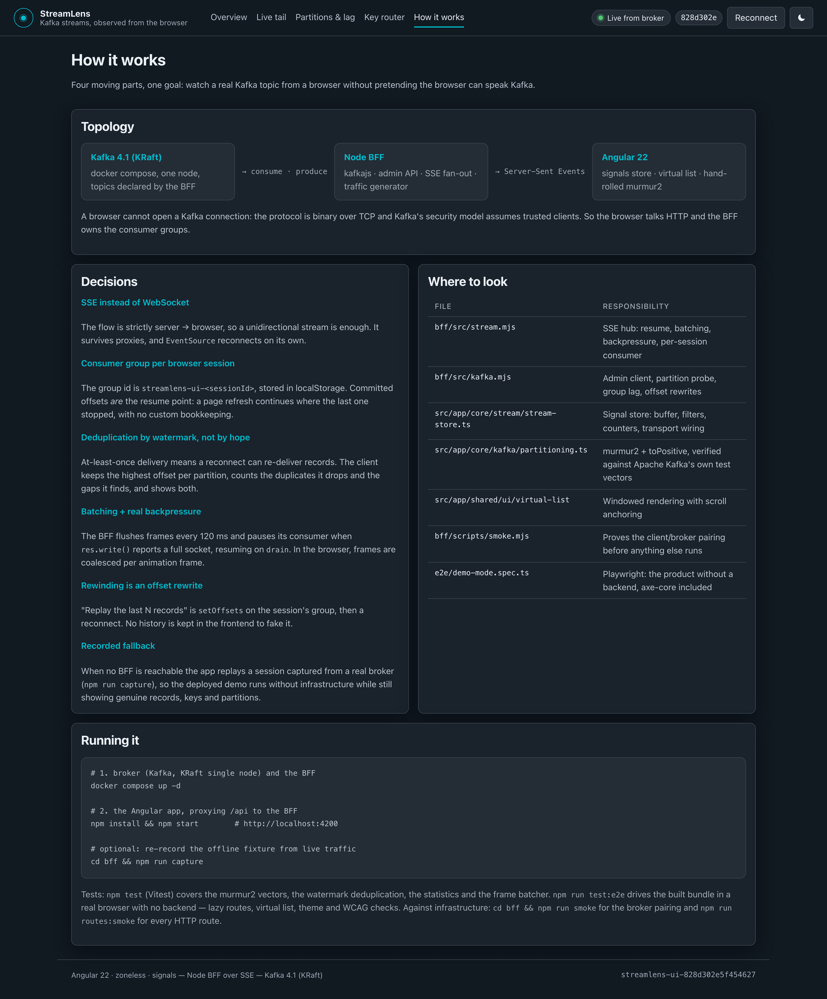

# StreamLens

[](https://github.com/VitalieCondorache/streamlens/actions/workflows/ci.yml)
[](https://vitaliecondorache.github.io/streamlens/)
[](LICENSE)


**A Kafka topic, observed from the browser.** Angular 22 on the front, a small Node BFF over
Server-Sent Events in the middle, a real Kafka 4.1 broker (KRaft) behind it.

The point of the project is the seam in the middle: **a browser cannot speak the Kafka protocol**
(binary, TCP, trusted clients only), so "frontend + Kafka" is always *browser → HTTP → bridge →
broker*. StreamLens implements that seam properly and then puts the interesting Kafka concepts on
screen: partitions, offsets, consumer groups, lag, replay and key-based partitioning.

```
┌──────────────────────┐        ┌───────────────────────┐        ┌──────────────────────┐
│  Kafka 4.1 (KRaft)   │        │      Node BFF         │        │     Angular 22       │
│                      │        │                       │        │                      │
│  streamlens.orders   │◄──────►│  kafkajs consumer     │◄──────►│  signals store       │
│  streamlens.telemetry│ produce│  admin API            │  SSE   │  virtual list        │
│  6 + 3 partitions    │ consume│  traffic generator    │ frames │  hand-rolled murmur2 │
└──────────────────────┘        └───────────────────────┘        └──────────────────────┘
        docker compose                  npm start (bff/)              npm start (root)
```

## Quick start

Requires **Node 24** (`nvm use` reads `.nvmrc`) and Docker. Nothing else — no global CLI, no Kafka
installation.

```bash
docker compose up -d      # Kafka broker (KRaft single node) + the BFF container
npm install && npm start  # Angular dev server → http://localhost:4200
```

`docker compose up -d` also starts producing synthetic traffic (≈14 records/s), so the dashboard
has something to show immediately.

**No Docker available?** The app still works: when no BFF answers, it replays a session recorded
from a real broker (`public/demo-stream.json`, written by `npm run capture`). Same components, same
event shapes, same partitions — only the transport differs. That is exactly what the
[static demo](https://vitaliecondorache.github.io/streamlens/) is: the same bundle, deployed to GitHub Pages
with no backend at all.

```bash
npm run stack:up      # docker compose up -d
npm run stack:down    # docker compose down
npm run stack:logs    # follow the BFF logs
npm run bff           # run the BFF on the host instead (needs a reachable broker)
npm run lint          # ESLint: TypeScript, the templates, the bridge and the e2e specs
npm test              # 58 unit tests (Vitest)
npm run test:coverage # the same suite behind the coverage gate CI enforces
npm run bff:test      # 37 bridge tests (node:test) — no broker, no Docker
npm run test:e2e      # 12 end-to-end tests (Playwright) on two engines, built bundle
npm run test:e2e:live # 8 more against the live stack (needs docker compose up -d)
npm run verify        # everything above that needs no infrastructure, i.e. what CI runs
npm run format:check  # Prettier, enforced in CI
npm run bff:smoke     # prove client ↔ broker compatibility before anything else
npm run bff:routes    # walk every BFF route and assert the response shapes
npm run screenshots   # regenerate the images in this README (add :live for a real broker)
npm run capture       # re-record the offline fixture from live traffic
```

## Screenshots

Taken against the live stack (`docker compose up -d` + a real broker), not mocked up:

| Overview | Live tail |
| --- | --- |
|  |  |
| **Record inspector** | **Partitions and lag** |
|  |  |
| **Key router** | **How it works** |
|  |  |

They are generated from the app, not pasted in:

```bash
npm run screenshots:live   # against the dev server and a real broker
npm run screenshots        # against the built bundle, replaying the recording
```

Both runs are ordinary Playwright tests, so a screenshot can never show a screen that no longer
builds. The live pass is also the only automated check of the browser ↔ BFF ↔ broker path end to
end, which is how it caught a 500 on `/api/topics` that neither `ng build` nor a unit test could see.

## The screens

| Route           | What it shows                                                                                 |
| --------------- | --------------------------------------------------------------------------------------------- |
| `/overview`     | Throughput, buffered records, failure share, pipeline latency, broker metadata, notices        |
| `/tail`         | Live tail with filters, pause, scroll anchoring, virtualised rows, JSON inspector, **offset rewind** |
| `/partitions`   | Per-partition distribution, log start/end, committed offsets, consumer lag, resume positions   |
| `/key-router`   | `murmur2(key) % partitions` computed in the browser, then **verified against the broker**      |
| `/architecture` | The decisions below, rendered inside the app                                                   |

## The parts worth reading

**1. Resuming is a consumer group, not a buffer.**
The browser generates a session id (localStorage) and the BFF uses it as the group id:
`streamlens-ui-<sessionId>`. Committed offsets therefore *are* the resume point — refresh the page
and the new SSE connection continues where the last one stopped. No custom offset bookkeeping
anywhere.

**2. Rewinding means rewriting offsets.**
"Replay the last 500 records" is `admin.setOffsets()` on that group followed by a reconnect
(`POST /api/replay` → the client drops its buffer and reconnects). The client cannot fake history,
because it does not keep any. See `bff/src/kafka.mjs` and `bff/src/server.mjs`.

**3. Backpressure is handled, not buffered.**
`bff/src/stream.mjs` batches frames per flush window, writes them with a single `res.write()`, and
when that write reports a saturated socket it calls `consumer.pause()` and waits for `drain`: the
broker keeps the records, the process keeps its memory. The UI reports the pause in its notice feed.
On the browser side `frame-batcher.ts` coalesces frames into one signal write per animation frame.

**4. At-least-once delivery is visible.**
Kafka can re-deliver after a reconnect, so the store keeps the highest offset per partition
(`partition-watermarks.ts`), drops duplicates, counts them, and *also* counts the gaps it finds
(`offset > watermark + 1`). The dashboard shows accepted / duplicates / missing / late, so a broken
pipeline cannot hide behind a pretty chart.

**5. The partitioner is reproduced, then verified.**
`src/app/core/kafka/partitioning.ts` implements Kafka's `Utils.murmur2` + `toPositive` with 32-bit
overflow semantics. Three independent checks back it up:

- Kafka's own `UtilsTest.java` vectors, asserted in `partitioning.spec.ts`;
- 5 000 random keys compared against KafkaJS's JVM-compatible partitioner during development;
- the live broker: `POST /api/partition-probe` produces the key (one record per request, so the
  produce metadata maps 1:1 to a key) and reports the partition it actually landed on.

Same key → same partition → per-key ordering. That is the whole reason partitioning exists, and the
Key Router screen makes it observable instead of theoretical.

## Layout

```
docker-compose.yml            Kafka (KRaft) + BFF
proxy.conf.json               dev-server proxy: /api → localhost:4000
bff/
  src/config.mjs              env-driven configuration + declared topic topology
  src/events.mjs              synthetic domain events (orders, payments, scanner telemetry)
  src/simulator.mjs           producer loop with rate control and failure bursts
  src/kafka.mjs               admin client, partition probe, group lag, offset rewinds
  src/stream.mjs              SSE hub: resume, batching, backpressure, per-session consumer
  src/http.mjs                ~60 line router (no web framework)
  test/                       node:test: router, SSE hub, backpressure, generator, config
  scripts/smoke.mjs           broker compatibility smoke test
  scripts/routes-smoke.mjs    boots the bridge and asserts every route's shape
  scripts/capture-fixture.mjs records the offline demo
e2e/                          Playwright: the product without a backend, live checks, screenshots
.github/workflows/ci.yml      4 jobs: format+lint+unit+build, e2e (3 engines), bridge+smoke, live
.github/workflows/pages.yml   the recorded-session bundle deployed to GitHub Pages
.github/dependabot.yml        npm (root + bff), GitHub Actions and the Kafka image
docs/screenshots/             generated by `npm run screenshots:live`
public/demo-stream.json       the recorded session the offline demo replays
src/app/
  core/models/                the wire contract with the BFF
  core/kafka/partitioning.ts  murmur2 + toPositive, verified against the broker
  core/stream/                transports (SSE + recorded), watermarks, batcher, signal store
  core/*-store.ts             diagnostics polling (httpResource), theme, session
  shared/ui/                  status pill, stat card, sparkline, virtual list, JSON tree
  features/                   overview, live-tail, partitions, key-router, architecture
```

## Tests

Four layers, each covering what the others cannot:

```
58 unit tests        npm test            Vitest + jsdom, milliseconds
37 bridge tests      npm run bff:test    node:test: the SSE hub, the router, the generator
12 end-to-end tests  npm run test:e2e    Playwright × 2 engines, the production bundle
 8 live tests        npm run test:e2e:live  Playwright against a real broker
 2 smoke tests       npm run bff:smoke   the client/broker pairing, against a live broker
                     npm run bff:routes  every BFF route, booted on a spare port
```

**Unit** — the parts that are worth reasoning about are pure functions: watermark deduplication
(including int64 offsets beyond `Number.MAX_SAFE_INTEGER`), the statistics aggregations, the frame
batcher with an injected scheduler, the recorded-replay transport with fake timers, the signal store
(buffer cap, pause, filters, rewind) and the live tail rendering rows and reacting to filters.

Coverage is measured too — `npm run test:coverage`, with the thresholds declared in `angular.json`
(75% statements / 76% lines / 62% branches / 55% functions) so a change that guts the tested core
fails the build instead of quietly shrinking it. Today it sits around 80% statements and 82% lines.
`sse-transport.ts` is the deliberate outlier at 3%: it only exists in a browser with `EventSource`,
so it is covered by the live end-to-end suite rather than by jsdom theatre.

**Bridge** — `npm run bff:test` runs `node:test` (no runner, no dependencies) over the part of the
pipeline with no UI attached: the SSE wire format and the resume token in every `id:`, the session
id sanitising that keeps a client from naming its own consumer group, the pause/`drain` backpressure
and the buffer ceiling that drops a session which never reads, the router's 404/413/500 mapping and
the simulator's rate clamping, failure backoff and payload invariants. These are the claims the
"Design decisions" section makes, so they are asserted rather than asserted-about.

**End-to-end** — `npm run test:e2e` builds the bundle and serves it as a plain static site with **no
`/api` backend**, so the app takes its recorded-session path and the suite needs no Docker, no Kafka
and no network. That is what makes it deterministic while still exercising a real browser: the lazy
routes, the virtual list, the `@defer` inspector, the theme round trip and the murmur2 verification.
Selectors use roles and labels wherever the markup has real semantics, and the suite fails on any
console error the app did not ask for. It also runs **axe-core** against the overview and the live
tail and fails on any WCAG A/AA violation — which is how the scrollable record list got its
`tabindex` and `aria-label`.

**Live** — `npm run test:e2e:live` points the same suite at the dev server, which proxies `/api` to
the bridge, so the assertions are allowed to be about Kafka itself: records arriving with their real
topic/partition/offset, a `Log end` that only the broker knows, the browser's murmur2 agreeing with
the broker on where a key lands (`matched == compared`), and a group rewind whose committed offsets
really moved — read back through `/api/lag` as an offset of a group that has no members. Skipped
unless `E2E_LIVE_URL` is set, because it needs `docker compose up -d`.

**Smoke** — two scripts that need infrastructure, both deliberately tiny. `npm run bff:smoke`
proves the client and the broker agree: connect, create a topic, produce, consume, read committed
offsets. `npm run bff:routes` boots the bridge on a spare port, walks every read endpoint and
asserts the shape of each answer — a broken route handler is invisible to the Angular build and
would otherwise only show up as a 500 in a browser.

CI runs all of them (`.github/workflows/ci.yml`) as four jobs: formatting, lint, unit tests and build;
the Playwright suite on three engines, with the HTML report uploaded as an artifact; the bridge tests
plus both smoke tests against a real `apache/kafka` service container; and the live path, which boots
the broker, the bridge and the dev server and then drives a browser against Kafka.

## Notes

- **Dev-server proxy quirk:** if the BFF restarts while a proxied SSE connection is open, the
  Angular dev server can end up wedged on that connection. Restart `ng serve`.
- **Static demo:** `npm run build:pages` emits a bundle that falls back to the recorded session, so
  it runs on GitHub Pages with no backend at all — `.github/workflows/pages.yml` deploys it on every
  push to `main` (enable *Settings → Pages → Source: GitHub Actions* once).
- **Angular version:** 22.1 — zoneless by default (`zone.js` is not a dependency), standalone
  components, signals, `httpResource`, `afterRenderEffect`, Vitest as the test runner, SCSS with
  design tokens.
- **Engines:** the browser suite runs on Chromium and WebKit by default and adds Firefox in CI
  (`E2E_BROWSERS=chromium,firefox,webkit`). Some macOS setups refuse to start Playwright's unsigned
  Firefox Nightly at all — Gatekeeper kills it with *"Could not find profile folder"* before it can
  read its profile — so the local default is the two engines a laptop can always launch.
- **Rendering:** client-only on purpose. An SSE-driven dashboard has nothing meaningful to render on
  the server — the first byte would be a skeleton — and the recorded-session fallback already covers
  latency, offline use and the static demo. SSR would add a second execution context to reason about
  for no observable gain. What *is* handled is the state before the first frame: the shell, the
  degraded pill and the notice feed all render from the fixture-less path.

## Stack

Angular 22.1 · TypeScript 6.0 · RxJS 7.8 (HTTP boundary only) · Vitest 4 · Playwright (Chromium,
Firefox, WebKit) · ESLint (typescript-eslint + angular-eslint) · SCSS ·
Node 24 · kafkajs · `node:test` · Kafka 4.1 (KRaft) · Docker Compose · no UI framework, no chart
library, no state library.

## License

[MIT](LICENSE) © Vitalie Condor.

Kafka and the Apache Kafka logo are trademarks of the Apache Software Foundation. This project is
an independent exercise and is not affiliated with or endorsed by it.
